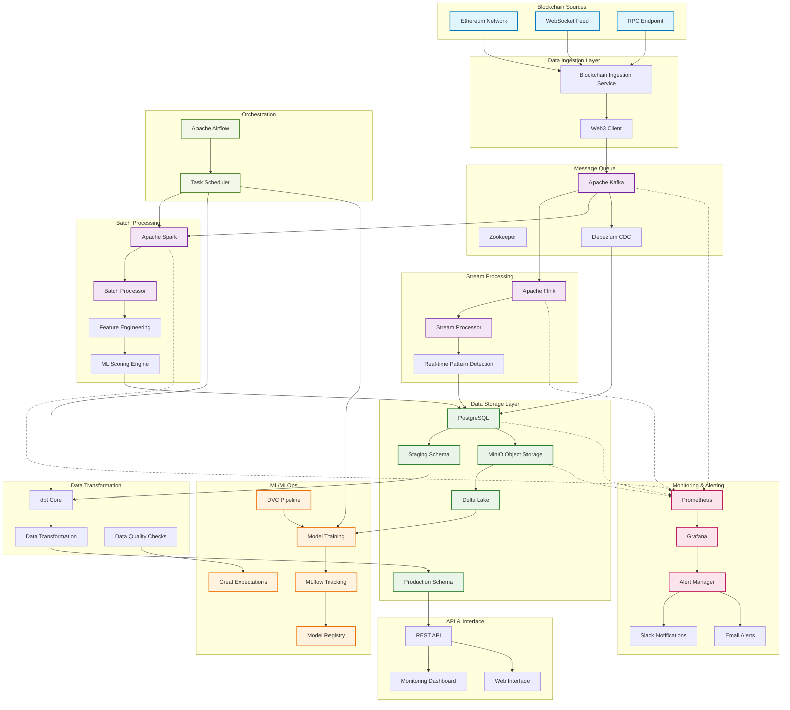

# Smart Money Tracking on Blockchain

A comprehensive MLOps pipeline for tracking and analyzing smart money movements on blockchain networks. This system identifies sophisticated traders, MEV bots, whales, and institutional actors through advanced behavioral analysis and machine learning.

## 🚀 Features

- **Real-time Blockchain Data Ingestion**: Monitors Ethereum transactions via Web3
- **Smart Money Detection**: ML-powered identification of sophisticated trading patterns
- **Behavioral Analysis**: Tracks gas usage, MEV activities, and DeFi interactions  
- **Real-time Alerts**: Instant notifications for significant smart money movements
- **Scalable Architecture**: Handles high-throughput data processing with Spark and Flink
- **Comprehensive Monitoring**: Prometheus metrics and Grafana dashboards

## 🏗️ Architecture

### Data Flow
1. **Blockchain Data Ingestion** → Real-time transaction monitoring
2. **Batch Processing** → Spark-based feature engineering and ML scoring
3. **Stream Processing** → Flink-based real-time pattern detection
4. **ML Pipeline** → Behavioral classification and smart money scoring
5. **Alert System** → Multi-channel notifications (Slack, Email)
6. **Data Lake** → MinIO with Delta Lake for historical analysis

### Tech Stack
- **Data Storage**: MinIO (Delta Lake), PostgreSQL
- **Stream Processing**: Apache Kafka, Apache Flink
- **Batch Processing**: Apache Spark
- **ML/MLOps**: MLflow, scikit-learn, Great Expectations
- **Monitoring**: Prometheus, Grafana
- **Containerization**: Docker, Docker Compose

## 🏗️ System Component Chart



### Component Descriptions

| Component | Purpose | Technology |
|-----------|---------|------------|
| **Blockchain Ingestion** | Real-time transaction monitoring and data collection | Web3.py, WebSocket |
| **Apache Kafka** | Message queue for streaming data pipeline | Kafka + Zookeeper |
| **Apache Flink** | Real-time stream processing and pattern detection | Flink SQL, CEP |
| **Apache Spark** | Batch processing for ML feature engineering | PySpark, Delta Lake |
| **PostgreSQL** | Primary data warehouse with staging/production schemas | PostgreSQL 15+ |
| **MinIO + Delta Lake** | Object storage for historical data and model artifacts | S3-compatible storage |
| **MLflow** | ML model tracking, versioning, and registry | MLflow Tracking Server |
| **dbt** | Data transformation and modeling | dbt Core |
| **Debezium** | Change Data Capture for real-time data sync | Debezium PostgreSQL Connector |
| **Prometheus + Grafana** | System monitoring and visualization | Metrics collection and dashboards |
| **Apache Airflow** | Workflow orchestration and scheduling | DAG-based task scheduling |
| **Great Expectations** | Data quality validation and testing | Data profiling and validation |

### Data Flow Summary

1. **Ingestion**: Blockchain data → Kafka topics
2. **Stream Processing**: Kafka → Flink → Real-time alerts
3. **Batch Processing**: Kafka → Spark → Feature engineering → PostgreSQL
4. **CDC**: PostgreSQL changes → Debezium → Kafka → Real-time sync
5. **Transformation**: Staging data → dbt → Production schema
6. **ML Pipeline**: Historical data → Model training → MLflow → Scoring
7. **Monitoring**: All components → Prometheus → Grafana → Alerts

## 📊 Smart Money Detection Criteria

The system identifies smart money based on:

- **Transaction Volume**: High-value transactions and cumulative volume
- **Success Rate**: Consistently profitable trading patterns
- **Gas Efficiency**: Strategic gas price optimization
- **MEV Activity**: Sandwich attacks, arbitrage, liquidation patterns
- **DeFi Sophistication**: Complex contract interactions
- **Behavioral Consistency**: Long-term profitable patterns

## 🚀 Quick Start

### Prerequisites
- Docker and Docker Compose
- 8GB+ RAM recommended
- Blockchain RPC API key (Alchemy/Infura)

### 1. Clone and Configure
```bash
git clone <repository-url>
cd Smart-Money-Tracking
cp configs/config.yaml.example configs/config.yaml
# Edit configs/config.yaml with your blockchain RPC URLs
```

### 2. Start Core Infrastructure
```bash
# Start MinIO, PostgreSQL, Kafka, and monitoring
docker compose -f smart-money-docker-compose.yaml up -d

# Wait for services to initialize (2-3 minutes)
docker compose -f smart-money-docker-compose.yaml logs -f
```

### 3. Initialize Database
```bash
# Database schema is automatically created via init_db.sql
# Verify PostgreSQL is ready
docker exec smart-money-postgres psql -U postgres -d smart_money_db -c "\\dt staging.*"
```

### 4. Start Data Processing Services
```bash
# Start blockchain ingestion
docker compose -f smart-money-docker-compose.yaml up blockchain-ingestion -d

# Start batch processing
docker compose -f smart-money-docker-compose.yaml --profile batch up -d

# Start stream processing  
docker compose -f smart-money-docker-compose.yaml --profile stream up -d

# Start alert monitoring
docker compose -f smart-money-docker-compose.yaml up alert-monitor -d
```

### 5. Train ML Models (Optional)
```bash
# Train smart money detection model
docker compose -f smart-money-docker-compose.yaml --profile training up ml-trainer
```

## 🔧 Service Configuration

### Blockchain Data Sources
Edit `configs/config.yaml`:
```yaml
blockchain:
  ethereum:
    rpc_url: "https://eth-mainnet.g.alchemy.com/v2/YOUR_API_KEY"
    websocket_url: "wss://eth-mainnet.g.alchemy.com/v2/YOUR_API_KEY"
```

### Alert Notifications  
```yaml
monitoring:
  slack_webhook: "https://hooks.slack.com/services/..."
  email_alerts: ["admin@example.com"]
  alert_thresholds:
    large_transaction: 100  # ETH
    smart_money_confidence: 0.9
```

## 📈 Monitoring & Dashboards

Access the monitoring interfaces:

- **Grafana**: http://localhost:3000 (admin/admin)
- **Prometheus**: http://localhost:9090
- **Kafka UI**: http://localhost:8080  
- **MLflow**: http://localhost:5000
- **MinIO Console**: http://localhost:9001 (minio/minio123)

## 🔍 Key Metrics

The system tracks:
- Transaction volume and frequency patterns
- Gas price optimization strategies
- MEV extraction activities
- DeFi protocol interactions
- Success rates and profit estimation
- Wallet clustering and categorization

## 🚨 Alert Types

### Transaction Alerts
- **Critical**: >1000 ETH transactions or score >0.95
- **High**: >100 ETH transactions or score >0.8  
- **Medium**: >10 ETH transactions or score >0.6

### Wallet Alerts
- New smart money wallet detection
- Significant behavior pattern changes
- Unusual activity spikes

## 🛠️ Development

### Manual Operations
```bash
# Run batch processing manually
python batch_processing/smart_money_processor.py

# Train new ML model
python model_experiment/smart_money_model.py

# Test blockchain ingestion
python blockchain_ingestion/ethereum_client.py
```

### Data Pipeline Commands
```bash
# Upload data to Delta Lake
python utils/upload_data_to_datalake.py

# Run data validation
python data_validation/validate_data.py

# Stream data to PostgreSQL CDC
python utils/streaming_data_to_postgresql.py
```

## 📊 Data Schema

### Smart Money Wallets
- `wallet_address`: Ethereum address
- `smart_money_score`: ML confidence score (0-1)  
- `wallet_category`: whale/mev_bot/institutional/active_trader
- `total_volume`: Cumulative transaction volume
- `mev_activity_score`: MEV extraction indicator
- `defi_interaction_score`: DeFi protocol usage

### Transaction Features
- Behavioral patterns and gas optimization
- Contract interaction complexity
- Token transfer analysis
- Timing and frequency patterns

## 🔒 Security

- No private keys stored
- Read-only blockchain access
- Secure credential management
- Alert rate limiting
- Data validation and sanitization

## 📈 Performance

- **Ingestion**: 1000+ transactions/second
- **Processing**: Real-time stream processing
- **ML Scoring**: Batch updates every hour
- **Alerts**: <5 second latency
- **Storage**: Delta Lake with time partitioning

## 🤝 Contributing

1. Fork the repository
2. Create feature branch
3. Add comprehensive tests
4. Submit pull request with description

## 📝 License

MIT License - see LICENSE file for details.

## 🆘 Support

- Check service logs: `docker compose logs <service-name>`
- Verify configurations in `configs/config.yaml`
- Monitor Prometheus metrics for debugging
- Review Grafana dashboards for system health

---

**⚠️ Disclaimer**: This tool is for educational and research purposes. Always verify smart money patterns through multiple sources before making financial decisions.